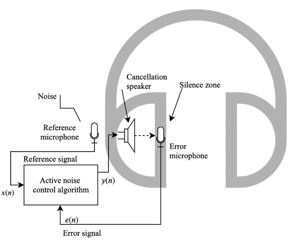

# RpiANC

Implementation of Active Noise Control Algorithms for Raspberry Pi.

This is the accompanying code to the publication 'Adaptive Active Noise Cancelling System for Headphones on Raspberry Pi Platform'
that will be presented at the Signal Processing Workshop 2020 conference https://mrweek.org/spw/


## Used hardware
* Raspberry Pi 3 Model A+

* Two Tiny MEMS Microphones - https://www.adafruit.com/product/3421

* On-ear headphones connected via 3.5mm jack





## Build and run commands

Example:
```
mkdir build && cd build
cmake ../ && make all
```

Main binary that does feedforward active noise control:
```
./ffANC
```

Simple tests that show how LMS and FxLMS attenuate simulated noise on matplotlib plots:
```
./lmstest
./fxlmstest
```

## Build dependencies 

Look into the CMakeLists.txt but the mainly (builds tested on Ubuntu 18.04 and Raspbian distributions):
```
Alsa library, so packages like: libasound2, libasound2-dev.
OpenMP
Python2.7 libraries (matplotlibcpp dependency) so packages like: python-dev
```


## Repository and code structure

Cmake and make commands build a few binaries. The main one, is the `ffANC` binary that executes tha main function from
the [feedforward_anc.cpp](Mains/feedforward_anc.cpp) file. Inside this file you can define  or remove the DEPLOYED_ON_RPI macro to
change devices used for capture and playback. Define CAP_MEASUREMENTS macro to capture sample values and save them to files.

Main of the `ffANC` target executes a specified number of loop iterations. During each iteration, 3 sections are executed in 3 separate threads using OpenMP directives. They: capture new samples from the input microphones, process previously captured samples and play the previously calculated output samples. After all 3 sections complete their tasks, data is exchanged between arrays, so that, in the next iteration, processing is done on the most recently captured data and the most recently calculated output samples are played.

In [constants.h](Headers/constants.h) file, you can find the names of devices used on Raspberry Pi and other constants used in signal processing.

All signal processing is in the header files under the [Headers](Headers)
and the [processing.cpp](Sources/processing.cpp) source file.

[Scripts](Scripts) directory contains python and bash scripts that automate measurements, gathering data, deploying code etc.


## Useful links, articles, etc.

* [Microphone wiring and connection guide](https://learn.adafruit.com/adafruit-i2s-mems-microphone-breakout/raspberry-pi-wiring-test#wiring-for-stereo-mic-3061608-5)
* [Introduction to Sound Programming with ALSA](https://www.linuxjournal.com/article/6735)
* [A Tutorial on Using the ALSA Audio API](http://equalarea.com/paul/alsa-audio.html)
* [Rpi I2S thread](https://www.raspberrypi.org/forums/viewtopic.php?t=91237)
* [Implementation of FIR Filtering in C](https://sestevenson.wordpress.com/implementation-of-fir-filtering-in-c-part-1/)


## Included third-party libraries

This software uses matplotlibcpp - see matplotlibcpp-license.txt
